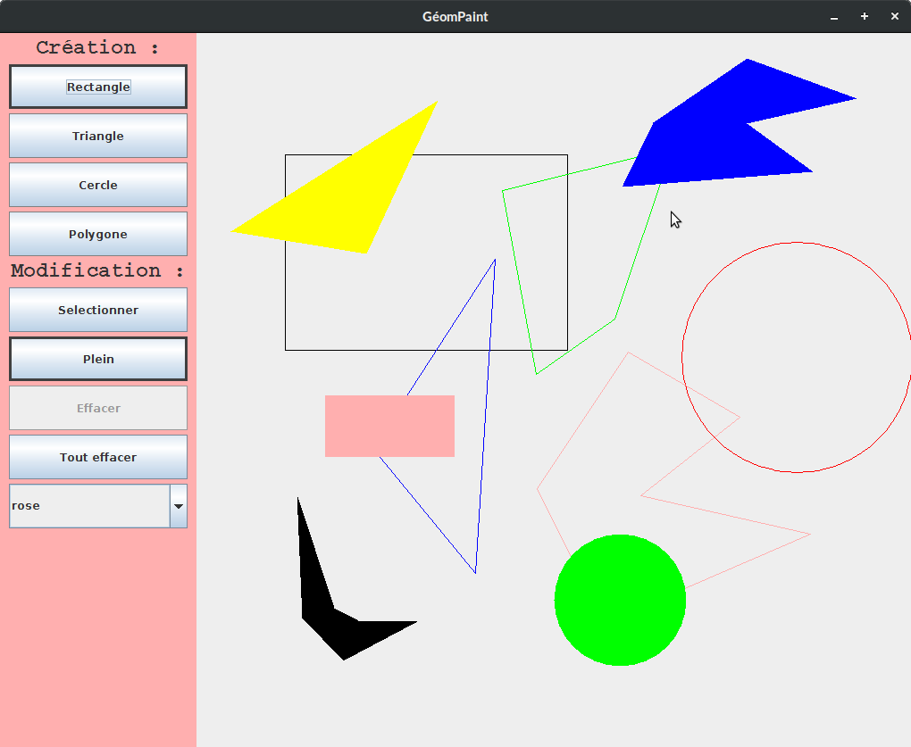
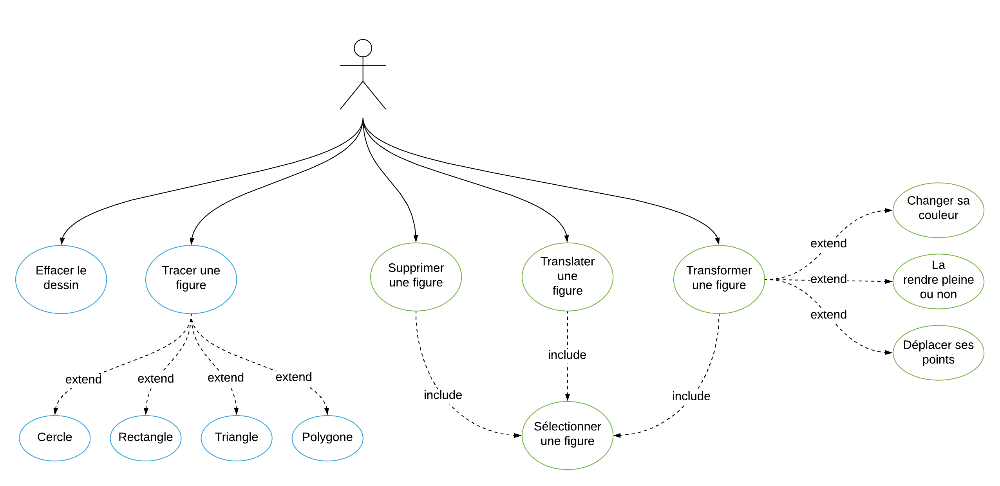
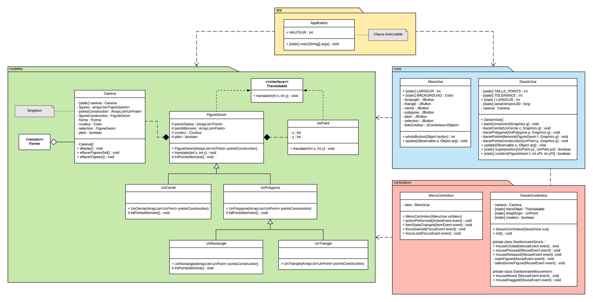
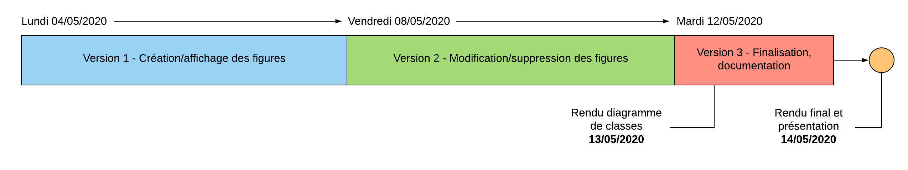

# GeomPaint

Logiciel de dessin, réalisé dans le cadre du DUT Informatique de l'IUT Nancy-Charlemagne

Participants au projet :

- DOSDA Clément
- FRIEDRICH Louis
- STEINMETZ Loïc
- TAVERNIER Julien

## 1 - Application

Cette application avait pour but de pouvoir créer 4 types de figures géométriques différentes : polygones, triangle, rectangle, cercle, construites à partir de points. Pour créer une figure il suffit de sélectionner le bouton correspondant à la forme souhaitée et de cliquer sur le caneva pour placer ces points. Chaque figure a un nombre de points différent à placer : 2 points pour le cercle et le rectangle, 3 points pour le triangle, n points pour le polygone ; Pour les polygones e dernier point placé doit être le même point que le premier afin de pouvoir refermer la figure. Ces figures peuvent donc être créés avec des caractéristiques particulières ou être éditées, avec différentes options, de couleur ou le remplissage. La modification d’une forme se fait par l’intermédiaire du bouton “sélection”, puis via un clic sur
l’une des figures d’une caneva. Une fois sélectionnée il est possible de faire glisser la figure pour changer son emplacement, et de faire glisser un point pour modifier sa position particulière. Il est également possible de changer le remplissage ou la couleur de la figure via le menu. Il est enfin possible de supprimer une figure sélectionnée ou nettoyer le dessin. Par ailleurs, la fenêtre est redimensionnable et un système de prévisualisation de la figure en cours de création a été implémenté.

## 2 - Conception

Pour garantir un développement efficace, nous avons pris le soin d’élaborer un
diagramme de classes complet. 

Comme il nous était recommandé d’utiliser la structure MVC, nous sommes partis des classes proposées dans le sujet pour construire les modèles des formes géométriques disponibles dans notre application. Pour une meilleure homogénéité du code, nous avons également implémenté le modèle UnPoint, qui compose donc la classe abstraite FigureGeom. Cette dernière regroupe tous les points communs des différentes formes, à savoir UnPolygone, UnTriangle, UnRectangle et UnCercle. Cela nous
permet d’importer une liste d’objets de type FigureGeom dans le modèle Caneva, qui regroupe toutes les fonctionnalités à destination de l’interface. Afin de rendre ce dernier instanciable partout et de garantir une unicité de ses attributs, nous lui avons choisi le design pattern Singleton. 

Quant aux vues, nous avons pris la décision d’en implémenter deux bien distinctes, l’une gérant l’affichage du dessin, et donc des formes à proprement dites. L’autre gérant l’affichage d’un menu comportant divers boutons pour faciliter l’interaction avec l’utilisateur 

Ces deux vues, MenuVue et DessinVue, ont donc chacune leur propre contrôleur, à savoir MenuControleur et DessinControleur, qui assurent l’accès aux modèles (aussi bien en lecture qu’en écriture). 

Enfin, la classe Application permet l’affichage de la fenêtre finale, composée des deux vues.

## 3 - Gestion de projet

Nous avons utilisé Git pour gérer les versions de notre projet et nous permettre de travailler en collaboration. Par ailleurs, Trello nous a servi à nous organiser dans les différentes tâches du projet.

Notre travail s’est donc divisé en trois phases :
- Développement d’une première version implémentant les fonctionnalités de base de l’application
- Développement d’une seconde version implémentant les fonctionnalités supplémentaire
- Développement d’une version de finalisation permettant les dernières corrections du
code

La conception de l’application conformément au pattern MVC nous a par ailleurs permis une division des tâches optimale, en nous permettant de travailler en parallèle sur
différents aspects du code en limitant les interférences. Ainsi, les modèles ont été principalement gérés par Louis Friedrich, la vue et le contrôleur liés au menu par Julien Tavernier, et la vue et le contrôleur lié au dessin par Loïc Steinmetz.

## 4 - Bilan

Étant parvenus à développer une application fonctionnelle et aux contrôles relativement intuitifs dans la limite du temps qui nous était accordé, nous sommes
globalement satisfaits des résultats de notre projet. Toutes les fonctionnalités prévues initialement pour l’application ont pu être implémentées, et ce en conservant une
organisation suffisamment modulaire de notre programme pour permettre l’ajout de nouvelles fonctionnalités. Le projet nous a ainsi permis d’approfondir nos connaissances et usages du pattern MVC, et d’explorer différentes possibilités offertes par la conception d’interfaces en Java.